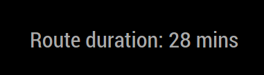

# MMM-trafficmate
This is a traffic module for the [MagicMirror](https://github.com/MichMich/MagicMirror). 
It is able to print estimated travel time in minutes from origin to destination.



## Used technolgies/tools
* [Magic Mirror Module Template](https://github.com/roramirez/MagicMirror-Module-Template)
* [Google Directions API](https://developers.google.com/maps/documentation/javascript/directions)

## Installation
Clone this repository in your `modules` folder, and install dependencies:
```bash
cd ~/MagicMirror/modules # adapt directory if you are using a different one
git clone https://github.com/markfodor/MMM-trafficmate.git
cd MMM-trafficmate
npm install
```

Add the module to your `config/config.js` file.
```js
{
    module: 'MMM-trafficmate',
    position: 'top_right',
    config: {
        apiKey: '<YOUR_API_KEY>',
        origin: '<ROUTE_ORIGIN>',
        destination: '<ROUTE_DESTINATION>'
    }
},
```
**The _apiKey_, _origin_ and _destination_ fields are mandatory**.

Optional config properties

| Name | Options | Default value |
| --- | --- | --- |
| defaultText | - | "Route duration: " |
| travleMode | "DRIVING" / "WALKING" / "BICYCLING" / "TRANSIT" | "DRIVING" |

## Running tests
Run the `test` npm script
```
npm test
```

Current Tests:
- [ESLint](http://eslint.org/) for linting the javascript
- [stylelint](https://stylelint.io/) for linting the CSS with [stylelint-config-standard](https://github.com/stylelint/stylelint-config-standard) as its base
- [jsonlint](https://github.com/zaach/jsonlint) for linting the translation files
- [markdownlint](https://github.com/DavidAnson/markdownlint) for checking the markdown files (`README.md`, `CHANGELOG.md`, `LICENSE.txt`)
- [js-yaml](https://github.com/nodeca/js-yaml) to lint the `.travis.yml` (run through [grunt-yamllint](https://github.com/geedew/grunt-yamllint))

If it is possible it will also automatically fix some issues.

## Contribution
If you have any suggest, please let me know [by an issue](https://github.com/markfodor/MMM-trafficmate/issues/new).

## License
[The MIT License (MIT)](LICENSE)